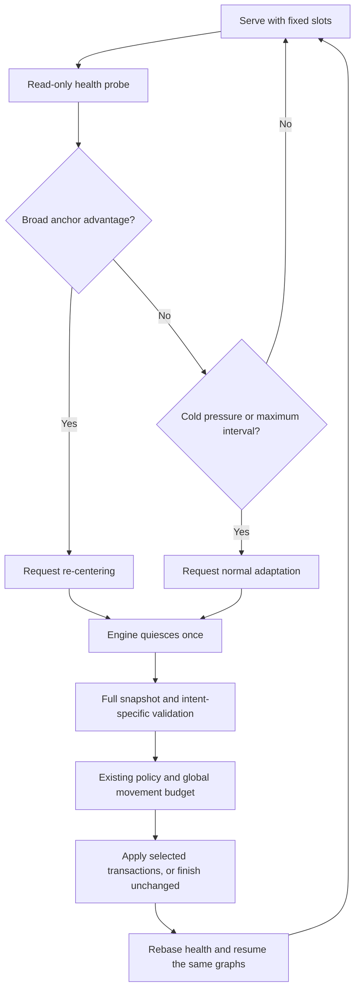

# Learned-anchor cache recovery

Status: **implemented; research-only**. An optional routing counterfactual scores
recent selections against both the live cache and its immutable learned initial
placement. This can detect a useful return to the learned workload even when the
live cache's absolute cold fraction is low. It estimates selection coverage, not
throughput. The [movement and recovery measurements](expert-cache-anchor-results.md)
separate this signal from the cost and effectiveness of acting on it.

## Identity and observation

`b12x.moe.residency.ResidencyAnchor` retains the validated profile hash,
checkpoint, recipe, workload and per-layer `ExpertPlacement` objects. The serving
integration constructs it only after the existing artifact, checkpoint, geometry
and resident-budget validation. The descriptor is not a replacement artifact
validator. Runtime construction verifies that the initial prepared resident sets
match the anchor. Promotions never modify the descriptor or the saved profile.

For each canonical expert count delta, the optional prepared health reduction
accumulates cold selections under the live map and under the anchor's resident
mask. The comparison uses identical counts and preserves duplicate selections.
Invalid router IDs remain excluded by the existing counter contract. Define:

```text
anchor advantage = (current cold selections - anchor cold selections)
                   / total valid selections
```

Positive advantage means that the learned placement would have covered more of
the observed routes. Per-layer comparisons retain the breadth of that advantage.
`RoutingAnchorThresholds` requires an explicit positive advantage threshold and
minimum fraction of layers favoring the anchor. All layers must have observations
before the rule can trigger. No threshold is a production recommendation.

The probe uses the existing producer-stream ordering, completion event and
single-result-slot ownership described in [cache health](expert-cache-health.md).
It does not run policy, decay scores, age residency guards or mutate slots.
Generation changes rebase the health counters before another probe. Counter
resets, stale generations, invalid mask values and unsigned overflow fail closed.
The anchor mask remains unchanged across rebases.

## Bounded re-centering

Adaptation and re-centering are explicit movement intents. Normal adaptation
retains the existing experimental decayed-LFU scoring. Re-centering uses that
same arithmetic, candidate threshold, score margin and residency guards, but
restricts candidates to missing anchor experts and victims to resident experts
outside the anchor. It does not force every anchor expert back into residency.
The model coordinator applies the same score-gain-per-copy-byte ranking and
global pair/byte budgets to either intent.

The engine owner requests re-centering only after an anchor probe triggers. At
the existing scheduler-owned maintenance boundary, the worker checks the anchor
advantage again over the complete policy observation window. That window can
disagree with the shorter probe interval. A declined re-centering request advances
the ordinary observation history without movement; it cannot silently fall back
to normal adaptation. A later normal request can adapt immediately. There is no
sticky anchor mode or second mutation protocol. Normal adaptation does not run
the full host-side anchor comparison; only an explicit re-centering request pays
for that second check.



The layer controller accepts `observe(..., recenter_to=resident_ids)`. The
model coordinator accepts `observe(..., recenter=anchor)` and validates all layer
geometries before consuming any observation. The maintained single-rank serving
adapter accepts `await maintenance.run(movement_mode="recenter")`. Normal calls
retain `movement_mode="adapt"`. Distributed anchor-triggered serving is not
qualified; the existing fail-closed mutation and reload contracts remain intact.

## Configuration and allocation

The opt-in serving configuration is `anchor_health=True`, which requires adaptive
mode and prepared health probes. The counter declaration is
`RoutingProfileQuery(health_summary=True, anchor_summary=True, ...)`, schema 5.
An anchor-free declaration retains its separate compiled health specialization.
Static mode allocates no observer, health mask or history.

For `L` layers with `sum(E_l)` experts, the anchor extension adds exactly:

```text
device payload = sum(E_l) bytes + 16 * L bytes
pinned host payload = 8 * L bytes
```

The device payload contains one uint8 tier value per canonical expert, one extra
int64 descriptor pointer and one uint64 output per layer. Descriptor/output rows
retain eight-byte alignment; mask entries require byte alignment. Model admission
charges these payloads once. Allocator rounding and event/host-object overhead
remain covered by reserved headroom. At 48 × 128 experts the extension adds
6,912 device bytes and 384 pinned bytes. It adds no per-route atomic or observer
launch. The prepared health reduction does additional mask reads and reductions.

The research harness exposes three separate controls:

- `--anchor-health`: record the counterfactual without changing movement control.
- `--anchor-advantage 0.02 --anchor-breadth 0.75`: enable the explicit recovery
  experiment, requiring two percentage points of advantage across at least 75%
  of layers.
- `--epoch-pairs 16 --epoch-mib 64`: bound movement independently of the trigger.

For example, within the source-built environment documented in the results:

```bash
python -m benchmarks.moe.expert_cache_serving \
  --model /models/Qwen3-30B-A3B-NVFP4 \
  --profile placement.json --mode adaptive --control health \
  --prompts benchmarks/moe/fixtures/expert_anchor_general_code_general.jsonl \
  --output anchor-serving.jsonl --admission together \
  --concurrency 4 --tokens 128 --epoch-tokens 16 \
  --cold-threshold 0.15 --health-max-tokens 1024 \
  --history-depth 0 --epoch-pairs 16 --epoch-mib 64 \
  --anchor-advantage 0.02 --anchor-breadth 0.75
```

The harness labels `anchor_advantage`, `pressure` and `maximum_interval` triggers
separately. Receipts include the actual movement intent, full-window assessment,
selected/proposed pairs and budget skips. Pair-cap skips take precedence when
both caps would reject a proposal. Skipped incremental copy bytes describe
unadmitted opportunities; they are not measured traffic or a latency estimate.
`--policy-diagnostics` additionally records per-layer counts, scores, candidate
pairs, selected subsets and protection state for proposal-ranking analysis.

## Retrospective analysis

Full policy diagnostics allow reconstruction of the live resident sets from
canonical counts and completed promotion receipts. The analyzer validates the
learned artifact against the prepared model and checks reconstructed cold counts
against the recorded maintenance totals:

```bash
python -m benchmarks.moe.analyze_residency_anchor \
  serving-with-policy-diagnostics.jsonl \
  --profile placement.json --output anchor-comparison.json
```

It reports current/anchor cold selections, per-layer advantage, missing anchor
experts and resident overlap. Windows crossing workload boundaries are labeled;
unobserved tails are reported rather than inferred. Compact anchor probes can
measure healthy return traffic without forcing full policy snapshots.

`benchmarks.moe.summarize_expert_anchor` combines exact paired-output validation
with movement receipts, anchor probes, overlap recovery and promotion lifetimes:

```bash
python -m benchmarks.moe.summarize_expert_anchor adaptive.jsonl \
  --baseline static.jsonl --profile placement.json --output recovery.json
```

Probe intervals ending at a workload boundary can contain preceding traffic;
the report retains their timestamps and labels this limitation. Unfinished
promotion lifetimes remain right-censored rather than counted as zero-hit moves.

## Scope

The reference is one learned profile, not an optimal-placement oracle or workload
classifier. A hard reset is an offline counterfactual only. Anchor recovery does
not change router weights, canonical IDs, BF16 reduction, whole-K W4A16, route
weights, fixed allocation addresses or promotion transport. Healthy observations
and zero-movement decisions remain valid outcomes.

The shared identity and comparison contracts are backend-neutral. The serving
experiment uses canonical PCIe host backing on SM120; it does not impose that
storage model on SM103. The anchor reduction cross-compiles for SM103, but
physical B300 acceptance still requires static all-HBM, all-Grace and mixed
correctness, Grace TMA legality, same-graph updates, sanitizers and miss-service
measurement before adaptive serving.
