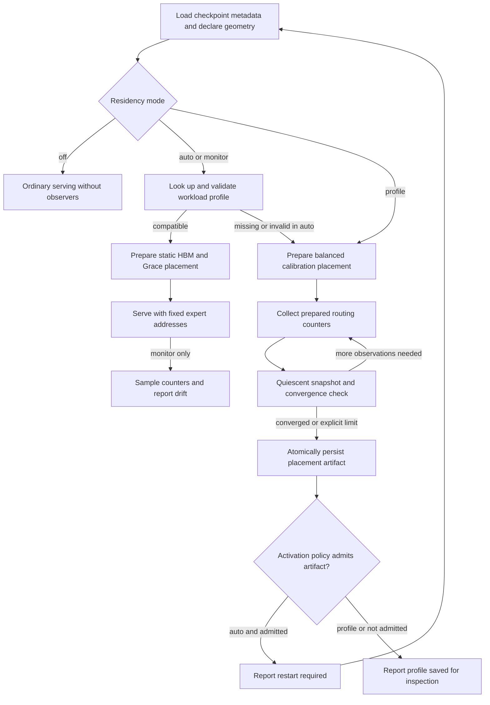

# Automatic SM103 expert residency

Status: **implemented orchestration prototype**. Automatic residency discovers a
workload-specific static placement and prepares it through the existing
`PreparationSession` API. Portable GPU tests qualify the counter operation,
including replay and lifecycle hooks. They do not qualify SM103 expert execution,
Grace-backed TMA, model quality or B300 performance. See the
[engineering ledger](expert-residency-ledger.md) for source-bound results.

The engine opts in once, supplies its checkpoint identity and memory reservations,
and connects the worker hooks to routing and its control loop. Users do not need
to capture individual expert IDs, construct JSONL traces or choose a fixed hot
expert count. This is an integration API; an unmodified vLLM installation does
not acquire an automatic residency command-line flag by importing b12x.

## Startup and activation



The controller never reconfigures live storage. On a cache miss, it produces a
budget-admitted bootstrap map that balances resident fractions across layers.
After mandatory minimums, it prioritizes each layer's next row by
`already_hot / total_experts`, with deterministic layer/ID ties. Otherwise
identical layers differ by at most one hot row; larger layers receive
proportional coverage when capacity permits. Constraints and row sizes can
prevent exact balance. No synthetic selection counts are recorded. Joint byte
feasibility takes precedence over this prior. Learned placement remains free
to allocate HBM unequally from real routing evidence. The physical hierarchical
backend must already work for calibration to serve requests. Profiling does not provide a fallback
around unqualified Grace TMA or an unsupported source format.

After convergence, `auto` reports `restart_required`; `profile` always reports
`profile_saved`. A sufficiently sampled but unconverged hard-limit result is
saved as `profile_saved` by default, including in auto mode. It is inspectable
but ineligible for automatic reuse. `activation="best_available"` explicitly
permits such a result to request restart and be reused. Both outcomes disable
counting at the worker's quiescent boundary. The existing placement stays active until the engine drains requests, releases
captured graphs and prepared owners, and reloads. On restart, an accepted artifact declares ordinary static residency plans;
a rejected artifact returns auto mode to calibration. There is no default
live migration, engine restart from inside b12x, or public prewarm/policy API.

## Typed configuration

The public types are exported by `b12x.moe.fused_moe`.

| Contract | Purpose |
| --- | --- |
| `AutomaticResidencyConfig` | Mode, workload name, provenance, explicit profile pin, cache reuse, activation acceptance and restart mechanism |
| `ResidencyCalibrationConfig` | Phase, sampling interval, minimum observations, window size, convergence thresholds and optional request/token limits |
| `ResidencyMonitorConfig` | Sampling interval, minimum observations and drift threshold |
| `ResidencyModelSpec` / `ResidencyLayerSpec` | Checkpoint/revisions, per-layer geometry, source/numerical recipe, capacities and optional hot-count bounds |
| `ModelExpertMemoryBudget` | One model-wide HBM/Grace envelope with reservations |
| `ResidencyHardware` | Compute capability and independently probed Grace coherency |
| `ResidencyProfileStore` | Versioned, hashed, atomic workload-profile storage |
| `ResidencyController` | Discovery, placement, convergence, drift and restart signaling |
| `RoutingProfileQuery` / `RoutingProfileConfig` | Registered preparation contract for device counters |

Modes:

- `off`: no discovery and no counter plan or graph node.
- `profile`: collect counters and save an artifact; never activate it.
- `auto`: reuse a valid artifact; otherwise calibrate and request restart.
- `monitor`: require a valid static artifact and report drift; never re-place
  experts. Missing or incompatible profiles fail startup in this mode.

Calibration defaults are `phase="decode"`, `sample_every=1`, 10,000 minimum
selections per layer, a 2,000-selection window per layer, four consecutive stable
comparisons, Jaccard similarity at least 0.99, and per-layer cold-fraction change
at most 0.002. Request and token limits default to `None`. Explicit limits can
produce a profile marked **not converged**; they do not waive minimum coverage
or the default convergence requirement for activation. Saving and activation
are separate decisions. A pinned path also requires the configured acceptance
policy; pinning alone does not accept an unconverged artifact.
Counts and limits are evaluated when the engine polls, so a limit can be exceeded
between polls.

Monitoring defaults to every 128th layer invocation, 10,000 sampled selections
per layer and a 0.02 absolute cold-fraction improvement threshold. These are
configuration defaults, not evidence of acceptable overhead or representative
traffic. `sample_every` is deterministic periodic sampling of complete calls;
it can alias periodic workloads. It does not claim unbiased random sampling.

`refresh="restart_required"` is the only supported activation mechanism.
`activation="converged"` is the default acceptance policy;
`activation="best_available"` accepts sufficiently sampled limit results as well.
Monitor uses the same acceptance policy and never modifies placement. Setting
`reuse_cache=False` forces calibration in auto mode. An explicit `profile_path`
is still validated and takes precedence over cache discovery.

## Geometry and memory budgeting

`ResidencyLayerSpec.from_weight_plan(...)` derives geometry and numerical metadata
from the loader's canonical `WeightPlan` and `ExecutionCapacity`. It supports the
same source-native MXFP4 E2M1/E8M0 K32, MXFP8/A8, BF16 I/O, SiLU/clamp contract as
[static residency](expert-residency.md). Different layers may have different
expert counts, hidden/intermediate widths, capacities and hot-count bounds.
Experts within one layer retain the backend's uniform tensor geometry. Geometry
changes require declarations and preparation, not edits to a model-specific
kernel.

Model budgeting computes:

```text
usable HBM for expert rows =
    HBM envelope
  - outstanding non-MoE model storage
  - other outstanding HBM allocations
  - KV reservation
  - HBM safety reserve
  - declared auxiliary profiling reservation
  - automatic counter storage
  - sum of private layer scratch
  - sum of layer route maps

usable Grace for expert rows = Grace envelope - Grace safety reserve
```

Every global reservation is charged once. Counter storage is added by the
controller, including in a cache-hit budget so the same configuration admits both
startup paths. Layer execution plans receive exact apportioned budgets with no
repeated model-wide KV or safety reserve. The existing preparation admission
also checks free device/host memory before materializing each layer.

Construct `ModelExpertMemoryBudget` directly for a total planned envelope, or use
`from_available(device=..., ...)` to snapshot free HBM before expert preparation.
For a free-memory snapshot, pass only **outstanding** allocations: already loaded
non-MoE weights or an allocated KV pool have already reduced free memory. The
helper conservatively uses available physical host pages when `grace_bytes` is
omitted. The engine may supply a smaller Grace limit. Checkpoint source tensors,
file-backed source views, CPU staging, other processes, and additional concurrent
model lanes must be accounted for by the integration. Free memory is not a
reservation against another allocator or process.

Weight/scale bytes, alignment, route maps and workspace come from the actual
residency storage layout. The allocator ranks `(layer, original expert ID)` rows
by selection count divided by resident byte cost. Ties prefer layer name, then
original expert ID. Within a layer this is selection-count order. It satisfies
per-layer minimum hot counts first, then fills fitting candidates up to each
layer's maximum. Uniform row costs maximize observed hot selections. Varying
costs use a deterministic density heuristic. HBM and Grace impose a joint
interval on resident expert bytes:

```text
total_expert_bytes - usable_Grace <= resident_bytes <= usable_HBM
```

When greedy packing leaves too much cold storage, an exact bounded subset-sum
fallback groups optional rows by byte size, divides sizes by their greatest
common divisor, and finds a reachable byte total in that interval. It respects
mandatory minimums and maximums. The fallback prefers the fullest feasible
packing and then the highest-priority rows within each size class. It proves
byte feasibility, not maximum selection-score optimality for varying sizes.
Within its search bound, it does not reject a feasible complement merely because
greedy left HBM fragmented.

The host search is capped at 8,000,001 reachable-bit positions and 512,000,000
retained history bits (about 61 MiB, plus temporary bitsets and Python objects).
A larger search fails with **feasibility unknown**, distinct from proven
infeasibility; explicit hot-count bounds or a validated static map can resolve
that unsupported case. This avoids unbounded startup memory/CPU work without
requiring an external solver. The common uniform-size case never needs this
fallback. Exact slab accounting and all reservations remain unchanged.
The algorithm identity is `selection_density_joint_v2`; automatic startup
invalidates profiles generated by the preceding allocator identity.

`minimum_hot` and `maximum_hot` are optional operational constraints; setting both
to the same value gives a debugging override. The normal path derives different
hot counts for different layers from one byte envelope.

## Integration example

The engine already owns `weight_plans`, CPU `weight_bundles`, `capacities`, a
checkpoint fingerprint verified against source bytes, and its memory plan. The
following creates b12x declarations without allocating CUDA expert storage:

```python
from b12x.moe import fused_moe as moe
from b12x.integration.vllm.expert_residency import ExpertResidencyWorker

model = moe.ResidencyModelSpec(
    checkpoint_fingerprint=checkpoint_fingerprint,
    model_revision=model_revision,
    tokenizer_revision=tokenizer_revision,
    layers=tuple(
        moe.ResidencyLayerSpec.from_weight_plan(
            layer=name, weight_plan=weight_plans[name], capacity=capacities[name],
        )
        for name in sorted(weight_plans)
    ),
)
config = moe.AutomaticResidencyConfig(
    mode="auto", workload="agent", provenance="dedicated agent serving lane",
    calibration=moe.ResidencyCalibrationConfig(
        phase="decode", token_limit=2_000_000,
    ),
)
budget = moe.ModelExpertMemoryBudget.from_available(
    device="cuda:0",
    grace_bytes=grace_limit,
    kv_reserved_bytes=outstanding_kv_bytes,
    other_hbm_bytes=outstanding_prepared_bytes,
    hbm_safety_bytes=hbm_safety_bytes,
    grace_safety_bytes=grace_safety_bytes,
)
controller = moe.ResidencyController(
    config=config, model=model, budget=budget,
    hardware=moe.ResidencyHardware.detect("cuda:0"),
    store=moe.ResidencyProfileStore(profile_directory),
    owner_rank=0,
)
worker = ExpertResidencyWorker(controller, rank=tp_rank, tp_size=tp_size)
progress = worker.startup()
expert_plans = {
    name: controller.plan_execution(
        layer=name, weight_plan=weight_plans[name], weights=weight_bundles[name],
    )
    for name in weight_plans
}
counter_request = worker.preparation_request()
```

Submit each expert plan's ordinary real-operation preparation request and the
optional `counter_request` to the engine's `PreparationSession`. The counter
request includes its own production-operation primer. Freeze the session before
capture. In `off` mode, use the engine's ordinary execution declarations instead
of calling `controller.plan_execution`.

For each calibration/monitor graph shape, bind the observer after the engine's
router has produced contiguous, 16-byte-aligned original expert IDs:

```python
observer = worker.bind_routes(
    layer=layer_name, phase=engine_phase, topk_ids=topk_ids,
)
expert_binding = moe.bind(
    expert_plans[layer_name], a=activations,
    topk_ids=topk_ids, topk_weights=topk_weights, output=output,
)

# This is the sequence the engine records in its CUDA graph.
if observer is not None:
    observer.run()
moe.run(binding=expert_binding)
```

The integration does not copy or extract IDs. A bound observer retains the source
buffer and programs. Valid cache-hit auto serving returns no observer. Live
positive M and top-k can vary under the prepared capacities; each captured graph
has its declared shape and stable addresses. Inputs change across replay without
recompilation. All phases and layers used by an observer are declared before
capture.

After warmup/capture, before accepting calibration traffic, pause submission and
call `worker.begin_calibration(quiescent=True)` to discard primer observations.
Periodically pause producer submissions and call:

```python
progress = worker.poll(
    request_count=completed_requests,
    token_count=processed_tokens,
    quiescent=True,
)
```

The request/token totals are cumulative engine-owned control-plane metadata.
`poll` synchronizes existing producer work and copies counters to the CPU. It
must not run per decode request or inside a captured operation. The engine owns
the polling schedule and the pause; `quiescent=True` is an explicit assertion
that new submissions cannot race the snapshot, reset or enable change. The
worker does not pause vLLM by itself.

Use `worker.inspect()` for progress and active profile metadata. `end_calibration`
stops an observer at a quiescent boundary. A disabled observer remains a graph
node with launch cost; reload/recapture without an observer to recover the plain
serving path. Polling a completed worker returns its terminal result without
reading counters again. Restarting its measurement requires a new controller
and preparation lifecycle.

The maintained companion preparation branch already uses `PreparationSession`;
the older SM103 companion does not. Neither wires automatic residency into its
loader and serving loop. The [integration audit](expert-residency-integration.md)
identifies the concrete engine hooks and CPU checkpoint ownership needed for a
model larger than HBM. No old API is restored and no `sitecustomize` or production
monkeypatch is installed.

## Counter and phase semantics

The registered `routing_profile` variant prepares a CuTe `CountRoutes` kernel for
both int32 and int64 IDs. One CTA per invocation updates uint64 selection counts,
call/token totals, sampled call/token totals and a sticky overflow bit. All
negative and oversized IDs are ignored before narrowing. Duplicates increment
independently. Updates are GPU-scope atomics and support concurrent producer
streams; reset/snapshot and control changes require quiescent producers.

An addition that exceeds uint64 wraps and sets the sticky overflow bit. The host
rejects the complete snapshot with `OverflowError`; a reset starts a new epoch.
An existing calibration controller rejects an epoch change or decreasing
cumulative counts. It must be replaced when starting a different measurement.
No overflowed profile can be published through these hooks.

Counters live in one aligned preparation-owned slab. `RoutingProfileQuery.storage_bytes`
reports its exact size. Counters add no graph allocation, synchronization, D2H
copy or compilation. Profiling-off execution contains no counter kernel or
atomic instructions. The implemented observer is **adjacent to routing**, not
fused into the top-k kernel. Low sampling rates reduce atomic work but retain a
kernel launch on every observed call; measured overhead is required before using
monitor mode on a latency-sensitive lane.

Phase is explicit: `decode`, `prefill`, `verify`, or `draft`. Default decode
profiling excludes verification/draft routes. `all` explicitly pools those phases
and requires decode coverage before convergence. Counters retain phase-separated
records even when the controller pools them. Do not infer phase from row count:
a verifier window and concurrent decode requests can have the same M. Mixed-phase
batches must be separated by the engine or left unobserved; per-row mixed-phase
labels are not implemented.

For replicated TP routing, exactly one configured TP rank owns counters. Other
ranks' profiler declarations own no storage or programs, and their bindings
launch nothing. The controller rejects a non-owner snapshot. The engine
broadcasts the decision/artifact out of band and coordinates restart. Independent
DP/traffic lanes use separate controllers and workload stores. No per-step
collective is added. Expert-parallel local-ID profiling and aggregation across
independent routing domains are unsupported.

## Convergence and drift

Each convergence window uses differences between cumulative snapshots, so a long
history cannot hide an abrupt workload change. Every layer must have at least
the configured number of new selections to advance a window. Minimum total
observations apply independently to every layer. Decode/all calibration also
requires decode observations in every layer.

The controller computes a model-wide candidate from each window and compares
per-layer hot sets with the previous window using Jaccard similarity. Empty hot
sets have similarity 1. It checks each layer's predicted cold fraction against
the previous window and verifies membership agrees with the cumulative placement
that would be saved. All layers must pass for the consecutive-stability counter
to advance; a changed set/rate resets it. Diagnostics report similarities,
per-layer cold fractions, overall cold fraction and stable-window count.

An explicit request/token limit saves a nonconverged artifact only when minimum
observations and phase coverage are satisfied. Otherwise the controller returns
`insufficient`, writes nothing and leaves the bootstrap placement intact.

Monitor uses disjoint observation windows after minimum coverage. It compares
the active map and a budget-aware candidate against the same counts. Results
include active/candidate cold fractions, per-layer hot-set overlap, changed HBM
membership displaced as a fraction of the active hot set, and bytes that would
change tiers. Additions are also visible in Jaccard similarity and moved bytes. `recommended=True`
means the estimated cold-selection reduction meets the configured threshold.
It is not a throughput forecast. Monitor neither writes a replacement artifact
nor changes the active placement; the engine can schedule a separate calibration
and controlled restart.

## Artifact identity and store

The model artifact uses schema 2 and records implementation version 1,
`selection_density_joint_v2`, and `statistics="selection_counts"`. Its hash covers
checkpoint/model/tokenizer identity, every layer's recipe/geometry/capacity and
bounds, workload, phase, provenance, timestamp, sample interval, selections,
convergence/termination state and request/token totals. Derived memory totals and
cold fractions are recomputed and checked on read. This is corruption detection,
not authentication of checkpoint bytes or signatures from a trusted publisher.

Startup requires exact model metadata, workload and phase compatibility, the
supported schema/implementation/algorithm, SM103 hardware, verified Grace
coherency for a nonempty cold tier, and fit within the current memory envelope.
Automatic activation additionally checks convergence unless the user explicitly
selects `activation="best_available"`. Artifact integrity and inspectability do
not imply permission to activate it.
Malformed or incompatible artifacts produce an explicit reason. Auto then
calibrates; monitor fails closed. Schema-1 trace profiles remain usable through
the static API, but are not sufficient for automatic reuse because they lack the
full model recipe and capacity contract.

The default store is `~/.cache/b12x/expert_residency`. Its deterministic namespace
hashes checkpoint identity, workload and model/phase identity. Each complete
artifact has a content-hash filename. `current.json` points to the last converged
artifact; `latest.json` points to the last saved artifact, including bounded
experiments. Default discovery uses the converged index. Best-available discovery
uses the latest index. If only an unconverged experiment exists, default startup
reports that rejection explicitly and calibrates. Saving an unconverged
experiment cannot displace an existing converged index.
Temporary-file writes, `fsync` and atomic replacement publish the artifact before
the index. Interrupted publication preserves the previous index. Different
workloads and checkpoints cannot overwrite each other's index; competing writers
in the same namespace have last-published-index semantics while preserving both
artifacts. Prefer one authoritative writer per lane.

```bash
python scripts/inspect_expert_residency_profile.py /profiles/HASH.json \
  --checkpoint-fingerprint CHECKPOINT_SHA256 --workload agent
```

The inspector verifies integrity and requested identity labels. Runtime reuse
still validates geometry, hardware, budgets and activation policy through the controller. The
static `read_profiles` helper can extract layer plans from either schema, and the
physical operator benchmark accepts generated model artifacts with geometry and
capacity checks.

## Rich traces and future scoring

`b12x.testing.vllm_routing_trace` remains an explicitly invoked diagnostic worker
extension. It captures bounded per-call IDs/weights and labels workload, phase and
checkpoint identity; records now also include each call's unique expert set.
It retains its research-only patching behavior and is never imported by automatic
residency. Its graph operations and D2H export are not throughput-neutral.

Use rich traces to study co-occurrence, top-k weights, verifier behavior and
unique cold working sets. Counter artifacts cannot reconstruct those details.
The `statistics` and algorithm identities leave room for a versioned future
objective such as cold expert bytes touched per engine step. Selection counts
remain the baseline until physical evidence supports another score.

## Workspace ownership and qualification

Every expert plan still owns its workspace. `model.workspace_estimate()` reports
private bytes and a hypothetical sequential-lane arena size; automatic budgeting
charges all private bytes and never spends the hypothetical saving. At H=5120,
I=2304, capacity=128 and top-k=6, 40 private workspaces occupy 2,074,060,800 bytes.
One sequential arena would save 2,022,209,280 bytes, about 1.88 GiB. These are
layout calculations, not measured HBM savings. A shared arena requires explicit
lane, stream, captured-graph and output-lifetime ownership. Concurrent lanes need
separate arenas; silent cross-plan aliasing is unsupported.
The [integration and ownership audit](expert-residency-integration.md#workspace-ownership)
defines the conditions required before an arena can change admission accounting.

Portable counter validation and overhead diagnostics:

```bash
python -m pytest tests/moe/test_automatic_residency.py -q
compute-sanitizer --tool memcheck --error-exitcode 99 \
  python -m pytest tests/moe/test_routing_profile_gpu.py -q
compute-sanitizer --tool synccheck --error-exitcode 99 \
  python -m pytest tests/moe/test_routing_profile_gpu.py -q
python scripts/compile_sm103_prepared.py --case moe:routing_profile \
  --output-dir /evidence/routing-profile-compile --workers 1
python scripts/compile_routing_profile.py --experts 384 --capacity 128 --top-k 8 \
  --sample-every 1 128 --output-dir /evidence/counter-variants
python benchmarks/moe/routing_profile.py --portable \
  --tokens 1 2 4 8 16 32 64 128 --top-k 1 6 8 \
  --output /evidence/portable-routing-profile.json
```

On physical B300, omit `--portable`, repeat with `--contention`, and run the
[complete operator gates](expert-residency.md#qualification-commands) with a
profile-derived map. The profiler benchmark compares the native residency route
partition alone with partition plus counter kernels in alternating order,
validates exact counts/routes and allocation-free replay, and records raw samples,
source hash, UUID, toolchain and GPU state. Its ratio is profiled/off latency;
values above one are slower. It is neither a top-k arithmetic benchmark nor a
full-MoE/C1/verifier-throughput measurement. Nsight and full-operator profiling
on B300 must establish that distinction before router fusion or monitor defaults
are changed. The legality and performance of TMA on coherent Grace expert slabs
remain independent physical gates.
